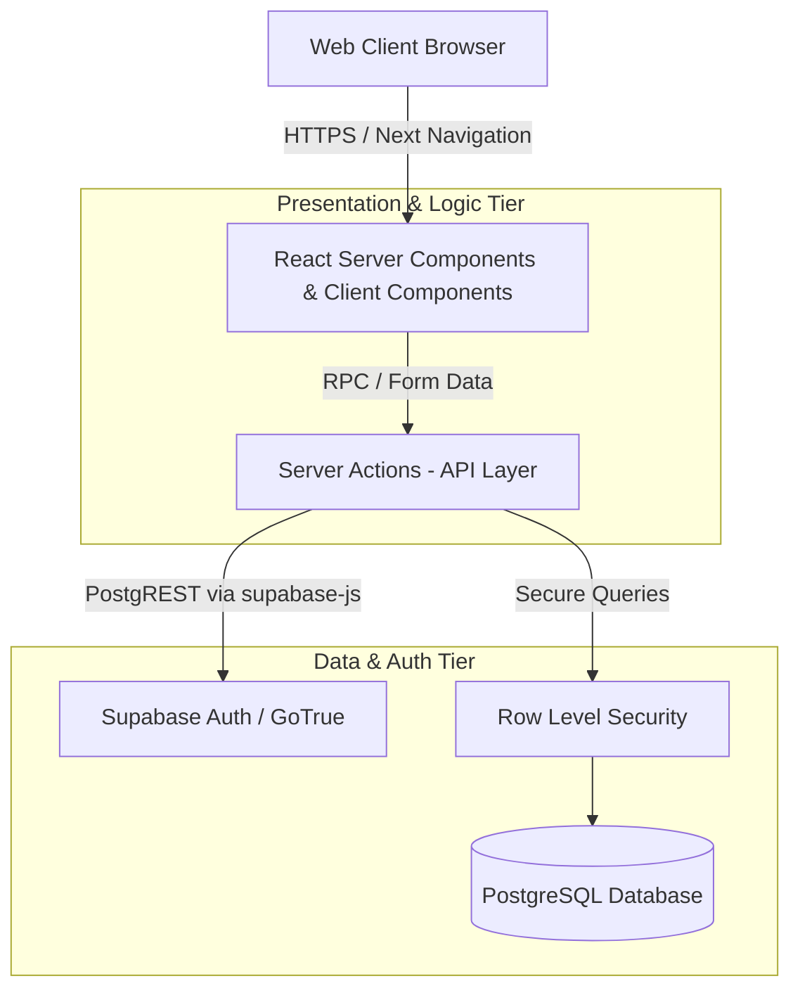

# TVC Portfolio OS - System Architecture

This document outlines the high-level architecture, technology choices, and design patterns for **Version 1** of the TVC Portfolio OS. It is designed to international standards, prioritizing maintainability, security, and a premium user experience.

---

## 1. System Overview

The TVC Portfolio OS is a modern, web-based platform built to manage venture capital portfolio companies, founders, fundraising status, advisory interactions, and due diligence compliance. The application follows a modern serverless architecture pattern, leveraging edge-ready infrastructure to ensure low latency, high availability, and secure data access.

### High-Level Architecture Diagram

---

## 2. Technology Stack

Our stack is carefully selected to balance rapid development with long-term scalability.

*   **Core Framework**: [Next.js 15](https://nextjs.org/) (App Router paradigm)
*   **Language**: TypeScript (Strict mode enabled for type safety across the entire stack)
*   **Database & Backend as a Service (BaaS)**: [Supabase](https://supabase.com/) (Managed PostgreSQL)
*   **Authentication**: Supabase Auth
*   **Styling**: [Tailwind CSS](https://tailwindcss.com/) (Utility-first CSS framework with explicit brand token overrides)
*   **Icons**: Lucide React
*   **Deployment Target**: Serverless edge platforms (e.g., Vercel)

---

## 3. Core Architectural Patterns

### 3.1 Feature-Sliced Design (Domain-Driven Structure)
Rather than organizing files by type (e.g., putting all components in one folder, all types in another), the codebase uses a **Feature-Based** directory structure inside `src/features/`. This keeps domain logic highly cohesive and prevents the architecture from becoming tangled as the application scales.

Domains implemented in V1:
*   `advisory/` - Advisor interactions and logging
*   `auth/` - Authentication flows and session management
*   `campaigns/` - Marketing and outreach tracking
*   `companies/` - Core startup profiles and health metrics
*   `exit-readiness/` - M&A readiness signals and scoring
*   `founders/` - Founder CRM and profiles
*   `funding/` - Cap table, runway, and funding rounds
*   `poem-ddr/` - Due Diligence and Data Room status
*   `search/` - Global command palette logic

### 3.2 Component Architecture
*   **Server Components (Default)**: Next.js React Server Components (RSC) are used by default to eliminate client-side JavaScript overhead and fetch data directly securely at the server level.
*   **Client Components**: Opt-in (via `'use client'`) only for interactive UI elements (e.g., modals, form state, complex hooks like `useDebounce`).
*   **Shared UI**: Generic, domain-agnostic components (e.g., Toasts, Command Palette) reside in `src/components/shared/`. Layout shells (Sidebar, Header) reside in `src/components/layout/`.

### 3.3 State Management Philosophy
We aggressively minimize heavy global state libraries (like Redux or Zustand) to reduce dependency bloat.
*   **Server State**: Managed natively by Next.js Server Components and Server Actions.
*   **Local UI State**: Managed via React `useState` and `useReducer`.
*   **Global Ephemeral State**: Managed via lightweight React Context (e.g., `ToastProvider`, `RoleShell`) or custom DOM events (e.g., `open-command-palette` event).

---

## 4. Data Access & Security Model

Security is a first-class citizen, ensuring that institutional data is strictly partitioned.

### Next.js Server Actions
All database mutations (Creates, Updates, Deletes) are handled via Next.js Server Actions (`*.action.ts`). This pattern completely eliminates the need to build and maintain traditional REST API endpoints, reducing boilerplate and attack surface.

### Supabase & Row Level Security (RLS)
The database operates on PostgreSQL with Supabase. 
1.  **Server Client**: Data is queried using a securely instantiated Supabase Server Client (`src/lib/supabase/server.ts`) that automatically inherits the user's session cookie.
2.  **RLS Policies**: PostgreSQL Row Level Security is enforced at the database level. Even if a backend query is maliciously altered, the database will refuse to return rows the authenticated user does not have permission to read or modify.
3.  **Role-Based Access Control (RBAC)**: Roles (e.g., `internal`, `angel`, `founder`) are utilized to conditionally render UI elements via the `useRole` hook and `RoleShell` component.

---

## 5. UI/UX & Design System

The application is built to convey a premium, state-of-the-art Venture Capital aesthetic.

*   **Color System**: Built on a highly constrained palette. We utilize Zinc (`zinc-50` to `zinc-900`) for neutral, structured backgrounds, and strictly reserve the brand color (`#1a23bd` - Royal Blue) for primary actions, active states, and focus rings. 
*   **Typography**: Modern sans-serif stack utilizing Inter and Geist typefaces for maximum legibility and crispness.
*   **Frictionless Micro-interactions**: The UI implements toast notifications for instant, non-blocking feedback. Heavy operations utilize debounced inputs (e.g., the Global Search) to prevent UI stuttering.
*   **Keyboard Accessibility**: Power-user features are prioritized, such as the `Cmd+K` global command palette, allowing rapid traversal of the application without touching the mouse.

---

## 6. Future Extensibility

This architecture is built for horizontal scaling. Adding a new domain (e.g., "Deals" or "LPs") simply requires scaffolding a new directory in `src/features/`. The use of Server Components and Server Actions ensures that as complexity grows, the client-side bundle size remains exceptionally small, maintaining peak performance.
