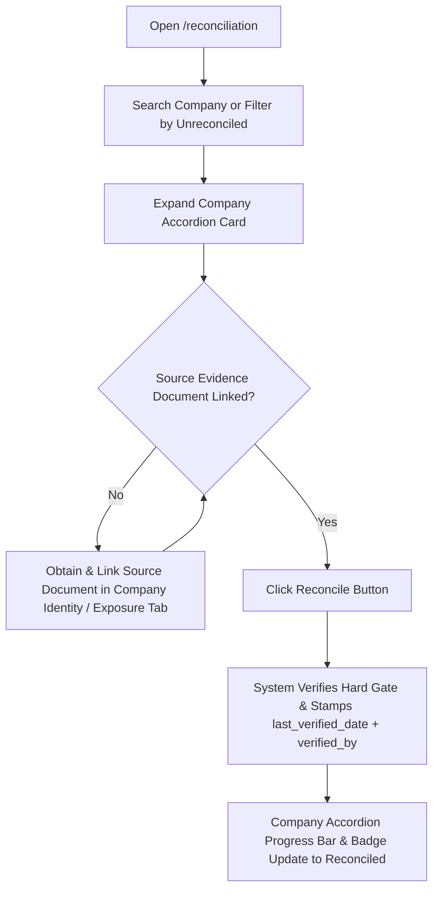
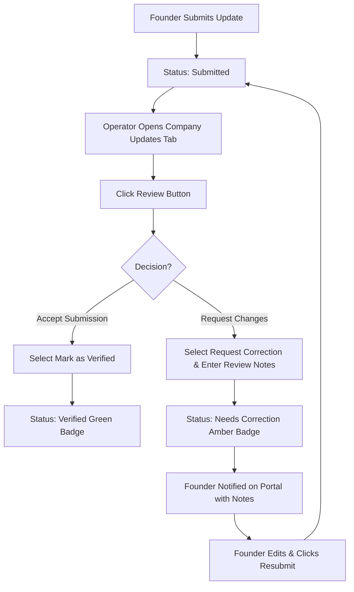

# Portfolio OS — Operational User Manual

**For**: Korede (Portfolio Operations Manager, TVCLabs)  
**Governing Objective**: Enable independent, accurate, and scalable operation of the TVCLabs Portfolio Revenue Engine without requiring engineering support or manual database edits.  
**System URL**: `https://portfolio.tvclabs.com` (or local development instance)

---

## Table of Contents
1. [System Overview & Operating Principles](#1-system-overview--operating-principles)
2. [Authentication & Access Protocol](#2-authentication--access-protocol)
3. [Module 1: Operating the Master Ledger Reconciliation Console (`/reconciliation`)](#3-module-1-operating-the-master-ledger-reconciliation-console)
4. [Module 2: Founder Monthly Reporting Pipeline (`/updates` & `/companies/[id]`)](#4-module-2-founder-monthly-reporting-pipeline)
5. [Module 3: Historical Point-in-Time Exposure Reconstruction (`/exposure`)](#5-module-3-historical-point-in-time-exposure-reconstruction)
6. [Module 4: Company Profile & Logo Management (`/companies/[id]`)](#6-module-4-company-profile--logo-management)
7. [Module 5: Monitoring Governance Gap Alerts & Thresholds (`/dashboard` & `/settings`)](#7-module-5-monitoring-governance-gap-alerts--thresholds)
8. [Step-by-Step Monthly Portfolio Review Protocol](#8-step-by-step-monthly-portfolio-review-protocol)
9. [Troubleshooting & Escalation Matrix](#9-troubleshooting--escalation-matrix)

---

## 1. System Overview & Operating Principles

Portfolio OS is TVCLabs' central operating platform for tracking portfolio capital deployment, equity positions, founder monthly updates, and governance verification. 

### Core Operating Principles
1. **Ledger Truth**: Every economic position (SAFE, Equity, Convertible Note, Advisory Equity) is backed by an event-sourced ledger. Positions are never manually edited; they are verified against source legal documents.
2. **Verification Hard Gate**: A position cannot be marked **Verified** or **Reconciled** unless at least one verified source document (SAFE contract, subscription agreement, wire receipt, side letter) is linked to an exposure event for that position.
3. **Founder Empowerment & Accountability**: Founders receive periodic target guidance, automated email reminders, and structured feedback if submissions require correction.
4. **Point-in-Time Fidelity**: Historical queries reconstruct positions and statuses dynamically as of the target date, ensuring pre-conversion and pre-dilution states are preserved.
5. **Dynamic Staleness Governance**: Position staleness is calculated dynamically against the global `staleness_threshold_days` setting (default: 90 days), alerting operators when position audits are overdue.

---

## 2. Authentication & Access Protocol

**Access Path**: Login Screen (`/login`)

Operators can sign into Portfolio OS using two supported authentication methods:

### 2.1 Sign-in Methods
1. **Magic Link (Default Passwordless)**:
   - Enter your registered email address on the **Magic Link** tab.
   - Click **Send sign-in link**.
   - Check your inbox and click the single-use sign-in button (expires in 60 minutes).
2. **Password Authentication (Test & Operator Accounts)**:
   - Click the **Password (Test)** tab at the top of the login card.
   - Enter your email address and password.
   - Click **Sign in with Password** to authenticate immediately.

### 2.2 Role-Based Redirection
Upon successful authentication, the system verifies your `app_metadata.role` claims and routes you automatically:
- **`admin` / `internal`** $\rightarrow$ Portfolio Control Center (`/dashboard`)
- **`angel`** $\rightarrow$ Angel Portfolio View (`/portfolio`)
- **`founder`** $\rightarrow$ Founder Portal (`/my-company`)

---

## 3. Module 1: Operating the Master Ledger Reconciliation Console

**Access Path**: Main Navigation Sidebar $\rightarrow$ **Reconciliation** (`/reconciliation`)  
**Authorized Roles**: `internal`, `admin`

### 3.1 Accordion-Based Company View
The Master Ledger Reconciliation Console organizes positions by company into clear, collapsible accordion groups:
- **Unreconciled Companies**: Open automatically by default so action items are immediately visible.
- **Fully Reconciled Companies**: Collapsed by default with a green **Reconciled** badge.
- **Progress Bars**: Displays company-level completion percentages (e.g., `2 / 3 positions verified (67%)`).

### 3.2 Key Portfolio Summary Metrics
- **Portfolio Companies**: Aggregate count of active portfolio companies.
- **Fully Reconciled**: Companies where 100% of underlying exposure positions have been audited and verified.
- **Total Exposure Positions**: Individual holder tranches across all instruments.
- **Verified Positions**: Positions audited with active source document evidence on record.
- **Overall Reconciliation Progress**: Portfolio-wide percentage bar.

### 3.3 Step-by-Step Position Verification Workflow

1. **Locate Target Company**:
   - Filter by status (**All**, **Unreconciled**, **Reconciled**) or search by company/holder name.
2. **Inspect Position Evidence**:
   - Expand the company's accordion card.
   - Check the **Source Evidence** column:
     - **Linked (Blue Link)**: Click to view/confirm the uploaded contract (SAFE, term sheet, wire receipt).
     - **Missing (Amber Warning)**: The **Reconcile** button is disabled. Navigate to `/companies/[id]` $\rightarrow$ **Exposure** or **Identity** tab to upload and link a source document to the exposure event.
3. **Execute Reconciliation Action**:
   - Click **Reconcile** on the position row.
   - The system verifies the document hard gate, stamps `last_verified_date = NOW()`, and records `verified_by = your_email`.
   - The position row turns green, and the company progress bar updates automatically.

---

## 4. Module 2: Founder Monthly Reporting Pipeline

**Access Path**: Main Navigation Sidebar $\rightarrow$ **Companies** $\rightarrow$ `[Company Name]` $\rightarrow$ **Monthly Updates** tab (or Founder Portal `/updates`)  
**Authorized Roles**: `internal`, `admin` (management & review), `founder` (submission & corrections)

### 4.1 Setting Monthly Reporting Targets
Operators can set period-specific performance targets for portfolio companies:

1. Navigate to `/companies/[id]` $\rightarrow$ **Monthly Updates** tab.
2. Locate the **Reporting Targets** card.
3. Click **+ Set Targets** or **Edit Targets**.
4. Enter target figures:
   - **Target Revenue ($)**: Monthly revenue milestone.
   - **Target MRR ($)**: Monthly recurring revenue target.
   - **Key Deliverables & Milestones**: Text description of expected operational goals.
5. Click **Save Targets**. Targets immediately display in the Founder Portal when the founder accesses `/updates`.

### 4.2 Triggering Automated Email Reminders
If a founder has not submitted an update for the current reporting cycle:

1. Open `/companies/[id]` $\rightarrow$ **Monthly Updates** tab.
2. If no submission exists for the current month, the banner will highlight: `Overdue: No update submitted for [Month Year]`.
3. Click the **Send Reminder** button on the right side of the status banner.
4. The system sends an automated email to the founder's CRM email address via Resend:
   - **Subject**: `Reminder: Submit Monthly Portfolio Update for [Company Name] ([Month Year])`
   - **Body**: Instructions and direct link to the Founder Portal (`/updates`).
5. A confirmation notification will confirm: `Reminder sent successfully to [founder_email]`.

### 4.3 Reviewing Founder Submissions (Verification vs Correction)
When a founder submits an update, its status becomes **Submitted (Blue Badge)**.

1. **Open Submission**: In `/companies/[id]` $\rightarrow$ **Monthly Updates** tab, locate the submitted card.
2. **Open Review Panel**: Click **Review** on the card header.
3. **Select Decision**:
   - **Option A: Mark as Verified**:
     - Select **Mark as Verified**.
     - (Optional) Add internal review notes.
     - Click **Save Review Decision**. Badge changes to **Verified (Green)**.
   - **Option B: Request Correction**:
     - Select **Request Correction**.
     - **Enter Reviewer Notes** *(Mandatory)*: Specify required corrections (e.g. *"Please provide revenue breakdown for B2B vs B2C segment"*).
     - Click **Save Review Decision**. Badge changes to **Needs Correction (Amber)**.

### 4.4 Founder Corrections & Resubmission
When marked **Needs Correction**:
1. Founder logs into `/updates` in the Founder Portal.
2. An amber alert banner appears: **Requested Corrections** with reviewer notes.
3. Submission form opens pre-filled.
4. Founder corrects response and clicks **Resubmit Update**.
5. Status returns to **Submitted**, alerting operators to re-review.

---

## 5. Module 3: Historical Point-in-Time Exposure Reconstruction

**Access Path**: Main Navigation Sidebar $\rightarrow$ **Consolidated Exposure** (`/exposure`)  
**Authorized Roles**: `internal`, `admin`

### 5.1 Understanding Point-in-Time Reconstruction
The Exposure engine allows operators to view TVCLabs' historical capital position on any past date ($D$), accurately handling pre-conversion, pre-exit, and pre-dilution states:

- **Pre-Conversion Status Reconstruction**: If a SAFE position converted to Equity in July 2026, querying as of May 2026 evaluates the SAFE as **`Active`** on that date.
- **Capital Deployed Filtering**: Only capital deployment events with `effective_date <= as_of_date` are included in totals.
- **Future Position Exclusion**: Positions issued or created after the target date $D$ are excluded entirely.

### 5.2 Operating the Date Filter
1. Navigate to `/exposure`.
2. Locate the **As of Date** filter in the section header.
3. Select a historical date (e.g., `2026-05-01`).
4. The dashboard re-renders with a highlighted banner:
   `Point-in-Time Position View (As of 01/05/2026) — Reconstructing active instruments & pre-conversion positions as of date`.
5. All summary metrics, instrument breakdowns, and company tables dynamically reflect portfolio state as of that date.
6. Click **Reset** to return to current active position view.

---

## 6. Module 4: Company Profile & Logo Management

**Access Path**: Main Navigation Sidebar $\rightarrow$ **Companies** $\rightarrow$ `[Company Name]` $\rightarrow$ **Overview** tab  
**Authorized Roles**: `internal`, `admin`, `founder` (own company)

### 6.1 Uploading / Replacing Company Logos
Company logos are rendered cleanly across the platform header, company cards, and founder portal. To upload or update a company logo:

1. Open `/companies/[id]` $\rightarrow$ **Overview** tab.
2. Click **Edit Profile** to open the identity form.
3. Locate the **Company Logo** upload card.
4. Click **Upload** or **Replace** (or hover over the logo box).
5. Select an image file from your computer:
   - **Allowed Formats**: `PNG`, `JPEG`, `WebP`, `SVG`
   - **Maximum File Size**: `2 MB`
6. The system executes a direct client-side upload to Supabase Storage (`company-logos` bucket) using your authenticated JWT context, updates `companies.logo_path`, and immediately refreshes the UI.

---

## 7. Module 5: Monitoring Governance Gap Alerts & Thresholds

**Access Path**: Main Navigation Sidebar $\rightarrow$ **Dashboard** (`/dashboard`) & **Settings** (`/settings`)

### 7.1 Understanding Governance Gaps & Position Staleness
A **Governance Gap** occurs when critical company profile information or position legal verifications have not been audited within the configured staleness threshold window.

- **Default Staleness Window**: `90 days`
- **Impact**: Positions older than the staleness window display an amber warning: `Verification Overdue: Critical fields have not been confirmed in over 90 days.`

### 7.2 Configuring the Staleness Threshold
Internal operators can adjust the portfolio staleness window:

1. Navigate to **Settings** (`/settings`) $\rightarrow$ **Thresholds** tab.
2. Locate **Position Verification Staleness**.
3. Edit the **Staleness threshold (days)** field (e.g. change from `90` to `60` or `120`).
4. Click **Save Thresholds**.
5. The system immediately updates `app_settings` key `staleness_threshold_days` and updates all dynamic governance gap calculations across `/dashboard`, `/companies`, and `/exposure`.

### 7.3 Resolving Governance Gaps
To clear an overdue governance gap for a company:
1. Open `/companies/[id]` $\rightarrow$ **Overview** tab and review profile attributes.
2. Open `/reconciliation` or `/companies/[id]` $\rightarrow$ **Exposure** tab.
3. Audit underlying legal documents and click **Reconcile** / **Verify**. This stamps `last_verified_date = NOW()`, clearing the gap.

---

## 8. Step-by-Step Monthly Portfolio Review Protocol

Follow this standard operating procedure (SOP) every calendar month to maintain 100% operational completeness.

```mermaid
gantt
    title Monthly Portfolio Review Protocol
    dateFormat  DD
    axisFormat  Day %d
    section Phase 1: Pre-Cycle Setup
    Target Setting & Reminders   :01, 5d
    section Phase 2: Active Submissions
    Founder Submission & Review  :06, 15d
    Corrections & Verification   :15, 6d
    section Phase 3: Reconciliation & Sign-off
    Master Ledger Reconciliation :21, 5d
    Portfolio Health Sign-off   :26, 3d
```

### Phase 1: Pre-Cycle Setup (Days 1–5 of the Month)
- [ ] **Review Target Thresholds**: Confirm `staleness_threshold_days` in `/settings`.
- [ ] **Set Monthly Targets**: For priority portfolio companies, open `/companies/[id]` $\rightarrow$ **Monthly Updates** tab and set target revenue/MRR/milestones for the new month.
- [ ] **Broadcast Reminders**: Trigger email reminders for any companies that have not yet submitted updates.

### Phase 2: Active Submissions & Review (Days 6–20 of the Month)
- [ ] **Monitor Incoming Updates**: Check `/dashboard` and `/companies` for new **Submitted** status badges.
- [ ] **Review & Verify Submissions**:
  - Verify figures against targets.
  - Mark clean updates as **Verified**.
  - Flag incomplete/unclear updates as **Needs Correction** with explicit reviewer notes.
- [ ] **Follow Up on Corrections**: Re-check resubmitted updates from founders and mark verified upon correction.

### Phase 3: Master Ledger Reconciliation & Health Sign-off (Days 21–28 of the Month)
- [ ] **Audit Master Ledger Console**: Open `/reconciliation`.
- [ ] **Reconcile Unverified Positions**: Link missing source legal documents and execute position reconciliations.
- [ ] **Update Portfolio Health**: Open `/companies/[id]` $\rightarrow$ **Overview** tab, set **Portfolio Health** (`Green`, `Amber`, `Red`), and enter health review notes.
- [ ] **Executive Sign-off**: Verify that 100% of tracked portfolio companies show active health reviews and reconciled exposure tranches.

---

## 9. Troubleshooting & Escalation Matrix

| Issue / Symptom | Probable Cause | Operator Resolution Steps |
|---|---|---|
| **Reconcile button disabled on `/reconciliation`** | Position has no linked source document | Open company page $\rightarrow$ Exposure/Identity tab. Link a source contract URL to an exposure event. The button will immediately enable. |
| **Password sign-in fails** | Incorrect password or unconfirmed user | Verify credentials. Use **Magic Link** mode if password needs resetting. |
| **Founder cannot submit update** | Account not linked or update already verified | Confirm founder email in CRM matches `crm_founder_id`. If update is already **Verified**, internal team must mark **Needs Correction** to allow edits. |
| **Email reminder fails to send** | `RESEND_API_KEY` missing or invalid email | Check if company has a linked founder email. If `RESEND_API_KEY` is unconfigured, system runs in simulation mode and displays the target address. |
| **Logo upload fails** | File > 2MB or unsupported MIME type | Ensure file is PNG, JPEG, WebP, or SVG under 2MB. |
| **Staleness warning appears unexpectedly** | Last verification date older than threshold | Perform position audit in `/reconciliation` or update company verification timestamp. |

---

*Manual maintained by TVCLabs Engineering & Operations Team.*
