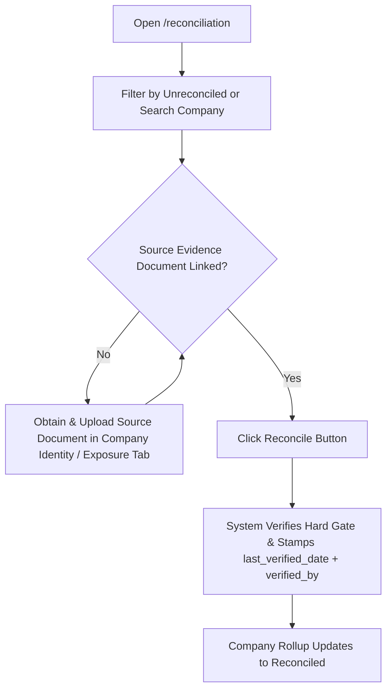
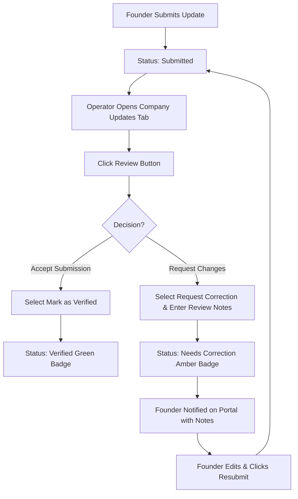

# Portfolio OS — Operational User Manual

**For**: Korede (Portfolio Operations Manager, TVCLabs)  
**Governing Objective**: Enable independent, accurate, and scalable operation of the TVCLabs Portfolio Revenue Engine without requiring engineering support or manual database edits.  
**System URL**: `https://portfolio.tvclabs.com` (or local development instance)

---

## 1. System Overview & Operating Principles

Portfolio OS is TVCLabs' central operating platform for tracking portfolio capital deployment, equity positions, founder monthly updates, and governance verification. 

### Core Operating Principles
1. **Ledger Truth**: Every economic position (SAFE, Equity, Convertible Note, Advisory Equity) is backed by an event-sourced ledger. Positions are never manually edited; they are verified against source legal documents.
2. **Verification Hard Gate**: A position cannot be marked **Verified** or **Reconciled** unless at least one verified source document (SAFE contract, subscription agreement, wire receipt, side letter) is linked to an exposure event for that position.
3. **Founder Empowerment & Accountability**: Founders receive periodic target guidance, automated email reminders, and structured feedback if submissions require correction.
4. **Dynamic Staleness Governance**: Position staleness is calculated dynamically against the global `staleness_threshold_days` setting (default: 90 days), alerting operators when position audits are overdue.

---

## 2. Module 1: Operating the Master Ledger Reconciliation Console

**Access Path**: Main Navigation Sidebar $\rightarrow$ **Reconciliation** (`/reconciliation`)  
**Authorized Roles**: `internal`, `admin`

### 2.1 Overview & Key Metrics
The Master Ledger Reconciliation Console provides a portfolio-wide audit view:
- **Total Portfolio Companies**: Aggregate count of active portfolio companies.
- **Fully Reconciled Companies**: Companies where 100% of underlying exposure positions have been audited and verified.
- **Total Exposure Positions**: Individual holder tranches across all instruments.
- **Verified Positions**: Positions audited with active source document evidence on record.

### 2.2 Understanding Master Ledger Status
- **Reconciled (Green Badge)**: All exposure positions for the company have been audited, possess linked source legal documents, and have `last_verified_date` stamped.
- **Pending Verification (Amber Badge)**: One or more positions for the company are either missing source legal documents or have not been audited.

### 2.3 Step-by-Step Position Verification Workflow

1. **Locate Target Company/Position**:
   - Use the status filter tabs (**All**, **Unreconciled**, **Reconciled**) or search bar to locate the target company or holder name.
2. **Inspect Source Evidence Status**:
   - Check the **Source Evidence** column:
     - **Document Linked (Blue Link)**: Click the link to view/confirm the uploaded contract (SAFE, term sheet, wire confirmation).
     - **Missing Evidence (Amber Warning)**: The **Reconcile** button is disabled. You must first navigate to the company's profile page (`/companies/[id]`) $\rightarrow$ **Exposure Tab** or **Identity Tab** and link a source document to the exposure event.
3. **Execute Reconciliation Action**:
   - Click the **Reconcile** button on the position row.
   - The system executes a server action that verifies the document hard gate, stamps `last_verified_date = NOW()`, and records `verified_by = your_email`.
   - Upon completion, the position badge turns to **Reconciled**, and the company rollup table updates automatically.

---

## 3. Module 2: Founder Monthly Reporting Pipeline

**Access Path**: Main Navigation Sidebar $\rightarrow$ **Companies** $\rightarrow$ `[Company Name]` $\rightarrow$ **Monthly Updates** tab (or Founder Portal `/updates`)  
**Authorized Roles**: `internal`, `admin` (management & review), `founder` (submission & corrections)

### 3.1 Setting Monthly Reporting Targets
Operators can set period-specific performance targets for portfolio companies to guide founder reporting:

1. Navigate to `/companies/[id]` $\rightarrow$ **Monthly Updates** tab.
2. Locate the **Reporting Targets** card.
3. Click **+ Set Targets** or **Edit Targets**.
4. Enter target figures:
   - **Target Revenue ($)**: Monthly revenue milestone.
   - **Target MRR ($)**: Monthly recurring revenue target.
   - **Key Deliverables & Milestones**: Text description of expected operational goals.
5. Click **Save Targets**. The targets will immediately display in the Founder Portal when the founder accesses `/updates`.

### 3.2 Triggering Automated Email Reminders
If a founder has not submitted an update for the current reporting cycle:

1. Open `/companies/[id]` $\rightarrow$ **Monthly Updates** tab.
2. If no submission exists for the current month, the banner will highlight: `Overdue: No update submitted for [Month Year]`.
3. Click the **Send Reminder** button on the right side of the status banner.
4. The system triggers an automated email to the founder's CRM email address using the Resend integration:
   - **Subject**: `Reminder: Submit Monthly Portfolio Update for [Company Name] ([Month Year])`
   - **Body**: Instructions and direct link to the Founder Portal (`/updates`).
5. A confirmation notification will confirm: `Reminder sent successfully to [founder_email]`.

### 3.3 Reviewing Founder Submissions (Verification vs Correction)
When a founder submits an update, its status becomes **Submitted (Blue Badge)**.

1. **Open Submission**:
   - In `/companies/[id]` $\rightarrow$ **Monthly Updates** tab, locate the submitted card.
2. **Open Review Panel**:
   - Click the **Review** button on the top right of the card.
3. **Choose Decision**:
   - **Option A: Mark as Verified**:
     - Select **Mark as Verified**.
     - (Optional) Add internal notes.
     - Click **Save Review Decision**. The update badge changes to **Verified (Green Badge)**, stamped with reviewer email and timestamp.
   - **Option B: Request Correction**:
     - Select **Request Correction**.
     - **Enter Reviewer Notes** *(Mandatory)*: Specify exactly what items require clarification or correction (e.g., *"Please provide revenue breakdown for B2B vs B2C segment"*).
     - Click **Save Review Decision**.

### 3.4 Founder Corrections Flow
When an update is marked **Needs Correction**:
1. The founder logs into `/updates` in their Founder Portal.
2. An amber alert banner appears: **Requested Corrections** displaying your reviewer notes.
3. The submission form is re-opened with their previous answers pre-filled.
4. The founder edits the response and clicks **Resubmit Update**.
5. The status returns to **Submitted**, alerting you to re-review the updated submission.

---

## 4. Module 3: Monitoring Governance Gap Alerts

**Access Path**: Main Navigation Sidebar $\rightarrow$ **Dashboard** (`/dashboard`) & **Settings** (`/settings`)

### 4.1 Understanding Governance Gaps & Position Staleness
A **Governance Gap** occurs when critical company profile information or position legal verifications have not been audited within the configured staleness threshold window.

- **Default Staleness Window**: `90 days`
- **Impact**: Positions older than the staleness window display an amber warning: `Verification Overdue: Critical fields have not been confirmed in over 90 days.`

### 4.2 Configuring the Staleness Threshold
Internal operators can adjust the portfolio staleness window:

1. Navigate to **Settings** (`/settings`) $\rightarrow$ **Thresholds** tab.
2. Locate **Position Verification Staleness**.
3. Edit the **Staleness threshold (days)** field (e.g. change from `90` to `60` or `120`).
4. Click **Save Thresholds**.
5. The system immediately updates the `app_settings` key `staleness_threshold_days` and updates all dynamic governance gap calculations across `/dashboard`, `/companies`, and `/exposure`.

### 4.3 Resolving Governance Gaps
To clear an overdue governance gap for a company:
1. Open `/companies/[id]` $\rightarrow$ **Overview** tab.
2. Review company profile details, identity fields, and portfolio health status.
3. Open `/reconciliation` or `/companies/[id]` $\rightarrow$ **Exposure** tab.
4. Audit underlying legal documents and click **Reconcile** / **Verify**. This stamps `last_verified_date = NOW()`, clearing the gap.

---

## 5. Step-by-Step Monthly Portfolio Review Protocol

Follow this standard operating procedure (SOP) every calendar month to maintain 100% operational completeness.

```mermaid
gantt
    title Monthly Portfolio Review Protocol
    dateFormat  DD
    axisFormat  Day %d
    section Phase 1: Pre-Cycle Setup
    Target Setting & Reminders   :01, 5d
    section Phase 2: Active Submissions
    Founder Submission & Review  :06, 15d
    Corrections & Verification   :15, 6d
    section Phase 3: Reconciliation & Sign-off
    Master Ledger Reconciliation :21, 5d
    Portfolio Health Sign-off   :26, 3d
```

### Phase 1: Pre-Cycle Setup (Days 1–5 of the Month)
- [ ] **Review Target Thresholds**: Confirm `staleness_threshold_days` in `/settings`.
- [ ] **Set Monthly Targets**: For priority portfolio companies, open `/companies/[id]` $\rightarrow$ **Monthly Updates** tab and set target revenue/MRR/milestones for the new month.
- [ ] **Broadcast Reminders**: Trigger email reminders for any companies that have not yet submitted updates.

### Phase 2: Active Submissions & Review (Days 6–20 of the Month)
- [ ] **Monitor Incoming Updates**: Check `/dashboard` and `/companies` for new **Submitted** status badges.
- [ ] **Review & Verify Submissions**:
  - Verify figures against targets.
  - Mark clean updates as **Verified**.
  - Flag incomplete/unclear updates as **Needs Correction** with explicit reviewer notes.
- [ ] **Follow Up on Corrections**: Re-check resubmitted updates from founders and mark verified upon correction.

### Phase 3: Master Ledger Reconciliation & Health Sign-off (Days 21–28 of the Month)
- [ ] **Audit Master Ledger Console**: Open `/reconciliation`.
- [ ] **Reconcile Unverified Positions**: Link missing source legal documents and execute position reconciliations.
- [ ] **Update Portfolio Health**: Open `/companies/[id]` $\rightarrow$ **Overview** tab, set **Portfolio Health** (`Green`, `Amber`, `Red`), and enter health review notes.
- [ ] **Executive Sign-off**: Verify that 100% of tracked portfolio companies show active health reviews and reconciled exposure tranches.

---

## 6. Troubleshooting & Escalation Protocols

| Issue / Symptom | Probable Cause | Operator Resolution Steps |
|---|---|---|
| **Reconcile button disabled on `/reconciliation`** | Position has no linked source document | Open company page $\rightarrow$ Exposure/Identity tab. Link a source contract URL to an exposure event. The button will immediately enable. |
| **Founder cannot submit update** | Account not linked or update already verified | Confirm founder email in CRM matches `crm_founder_id`. If update is already **Verified**, internal team must mark **Needs Correction** to allow edits. |
| **Email reminder fails to send** | `RESEND_API_KEY` missing or invalid email | Check if company has a linked founder email. If `RESEND_API_KEY` is unconfigured, the system runs in simulation mode and displays the target address. |
| **Staleness warning appears unexpectedly** | Last verification date older than threshold | Perform position audit in `/reconciliation` or update company verification timestamp. |

---

*Manual maintained by TVCLabs Engineering & Operations Team.*
